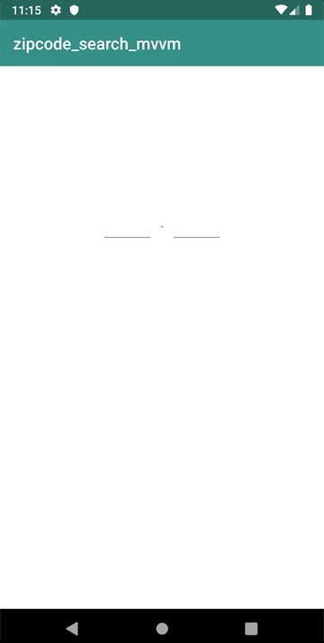

### やりたかったこと
1. API通信
2. Coroutineを使った非同期処理
3. MVVMを使ったアーキテクチャ

### 出来たこと
1. ~~okhttpを使ってAPI通信 ~~
   Retrofitを使ってAPI通信  
    (zipcloud.ibsnet.co.jp)のAPIを使用
2. APIの結果をCoroutineを使った非同期処理で描画
3. MVVMに沿った設計(多分出来てるはず)  
   **BaseObservableを使ってやり直し**

### 動作内容(ここは変わらず)

